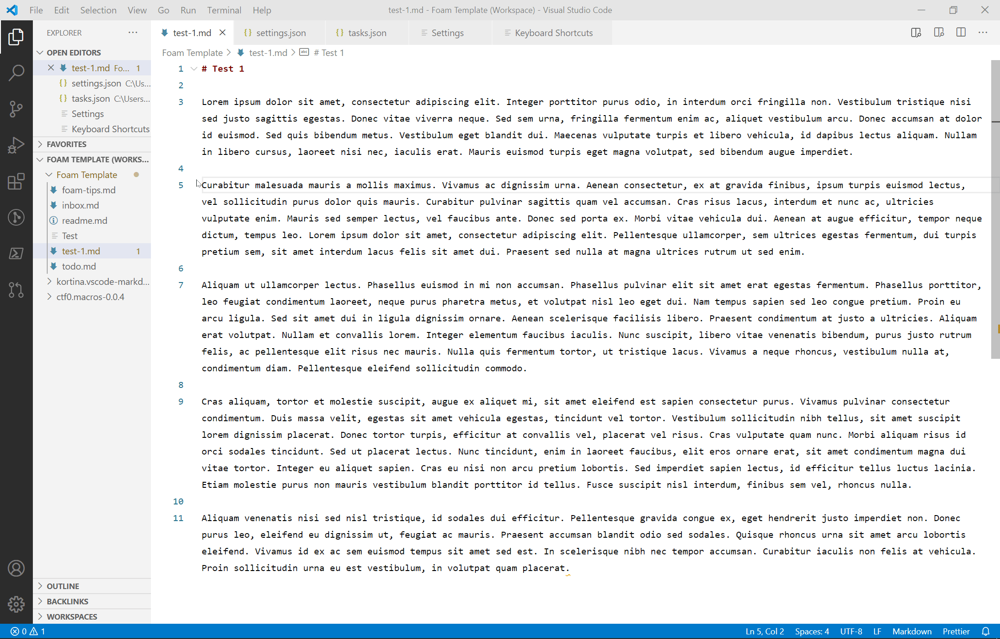

# NewNoteFromSelection-VSCode
Creates a new markdown file with selected text and replaces original text with link to new file



1. Install [Macros](https://marketplace.visualstudio.com/items?itemName=geddski.macros) extension
1. Install [FileUtils](https://marketplace.visualstudio.com/items?itemName=sleistner.vscode-fileutils) extension

    Note: They're pretty useful tools to have, so its not a complete "waste" to install them just for this task.

1. Open your User settings by pressing Ctrl+Shift+P and tpying "Open Settings (JSON)" or locating settings.json at the following paths
    - Windows %APPDATA%\Code\User\settings.json
    - MacOS $HOME/Library/Application Support/Code/User/settings.json
    - Linux $HOME/.config/Code/User/settings.json
1. Add the following code to the bottom of the file: 
    ```
    "macros.list": {
            "updateNote": [
                {
                    "command": "$delay",
                    "args": {
                        "delay": 500
                    }
                },
                "workbench.action.files.save",
                "editor.action.insertLineAfter",
                "editor.action.insertLineAfter",
                "editor.action.clipboardPasteAction",
                "cursorTop",
                "fileutils.copyFileName",
                "editor.action.clipboardPasteAction",
                "deleteLeft",
                "deleteLeft",
                "deleteLeft", 
                "cursorHomeSelect",
                "editor.action.clipboardCopyAction",
                "cursorTop",
                {"command": "type", "args": {"text": "# " }},
                "workbench.action.navigateBack",
                "deleteRight",
                {"command": "type", "args": {"text": "[[" }},
                "editor.action.clipboardPasteAction",             
            ],

            "copySelection": [
                "editor.action.clipboardCopyAction"
            ],         
        },
    ```
1. Open the user tasks file by entering Ctrl+Shift+P -> "Tasks: Open User Tasks". This file can also be found (or created) at the same user settings folder paths mentioned in step 3. 
1. Insert the following code into the file. If you don't have any existing tasks, you can replace the entire code. **NOTE: This is set to use Windows Powershell. You might have to modify the code, especially in the "newNote" section, if you are using a different system**
    ```
    {
        "version": "2.0.0",
        "tasks": [
          {
            "label": "newNote",
            "type": "shell",
            "command": "echo '' > '${input:fileName}.md' | code '${input:fileName}.md'", 
          },
          {
            "label": "copyText",
            "type": "shell",
            "command": "${command:macros.copySelection}"     
          },
          {
            "label": "newNoteFromSelection",
            "type": "shell",
            "command": "${command:macros.updateNote}",
            "dependsOrder": "sequence",
            "dependsOn": ["copyText", "newNote"]
          }
        ],

        "inputs": [
          /* {
            "type": "promptString",     
            "id": "folderName",
            "description": "Complete my folder name.",
            "default": "folder"
          }, */
          {
            "type": "promptString",
            "id": "fileName",
            "description": "Complete my file name.",
            "default": "new file name",
          }
        ]
      }
    ```

1. Open the user Keybindings file, by either entering Ctrl+Shift+P -> "Preferences: Open Keyboard Shortcuts (JSON) or opening this file from the same directory listed in Step 3.
1. At the bottom, add the following code and customize the keyboard shortcut to your preference.
    ```
    {
      "key": "ctrl+alt+shift+n",    // whatever you choose
      "command": "workbench.action.tasks.runTask",
      "args": "newNoteFromSelection"
    },

    ```
1. Open the markdown file with the text that you would like to extract. 
1. Select text.
1. Use the keyboard shortcut that you just set. 
1. Enter a title in the Input Box. If it has multiple words in it, you might consider adding "-" between each word in case it helps with links. However your links and graph node labels will have "-" in them.    
    
    *** This would also be a very good place for someone to improve the code with some sort of Regex find/replace for "-","_", etc... ***
    
1. Wait for macro to run. It should take a few seconds.
1. If you are unsatisfied with the results, you can undo it all by pressing Ctrl+Z. 
1. If you left spaces in the file names, delete the "dummy" files from your file tree when done processing all selections.
